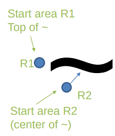
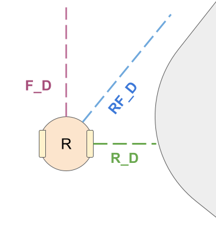
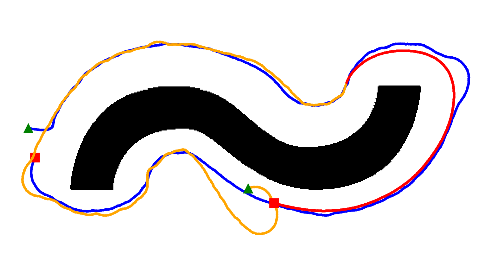

# Reactive Robot Simulator

See a demo of this project on Youtube:

Alternatively, you can read the [scientific article](docs/article.pdf).

## Assignment Description

Two Simple Reactive Robots:

- 2D X,Y, Theta
- Must have simple architecture (sensors, etc)
- Can NOT have memory
- Can have a general, undetailed idea of the map
- Can be subsumption architecture
- Can have a PID controller 

    
    

**Goal:** 

- R1 follows wall slowly
- R2 follows wall or R1 (the closest)

- Round, Differential locomotion
- Any tech, but must be ROS robots without communication

## Group

- João Alves (up202007614)
- Marco André (up202004891)
- Rúben Monteiro (up202006478)
