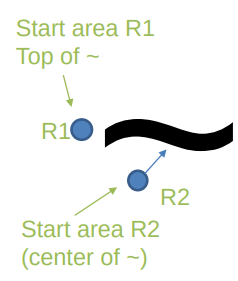

# RI 1

## Assignment Description

Two Simple Reactive Robots:

- 2D X,Y, Theta
- Must have simple architecture (sensors, etc)
- Can NOT have memory
- Can have a general, undetailed idea of the map
- Can be subsumption architecture
- Can have a PID controller 

**Goal:** 

- R1 follows wall slowly
- R2 follows wall or R1 (the closest)

- Round, Differential locomotion
- Any tech, but must be ROS robots without communication

Teacher recomendations:

- Parameterize everything
- Choose a good set of sensors
- Find a good distance for R2 to be on tail of R1 without colision

**Environment:** 

**Tech:** 

## Deliverables

- Source Code ZIP (with README*)
- Video (under 100MB and with FEUP Logo)
- Article

* The README shoud state:

- Directory structure
- Requirements (versions, dependencies, etc.)
- How to compile and execute

### Article

The 3/4 pages article should use the [LATEX template](https://www.ieee.org/conferences/publishing/templates.html) and contain:

- Abstract
- Intro (minimal)
- SOTA (minimal)
- Robot implementation and architecture (control law)
- Experiments
- Results and Discussion
- Conclusions and Future work
- Acknowledgments & References

Note: Not a tech report

#### Article Results

The article's results must include:

- Loop time 
- Travelled path
- Performance
- Discuss stuck robot
- Control 
- Possible Performance improvements

Bonus:

- Randomness
- Limited acceleration and angular velocity
- Results table with loop time and [accel, ang_vel, directions, …]

## Group

- João Alves (up202007614)
- Marco André (up202004891)
- Rúben Monteiro (up202006478)
